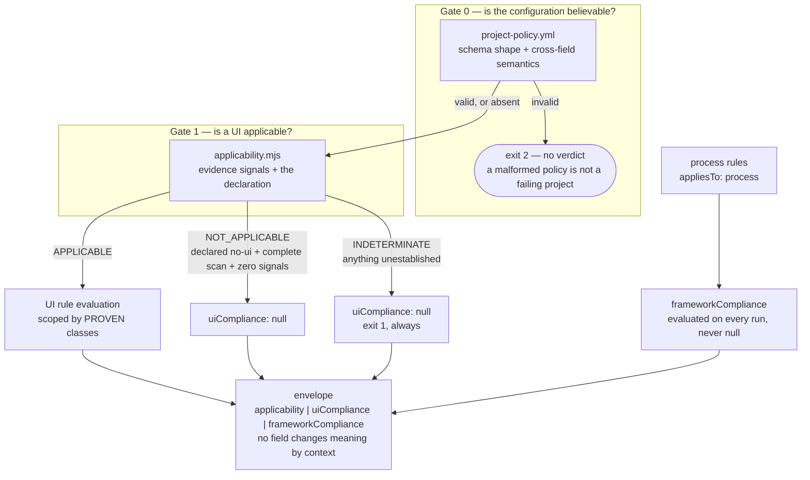
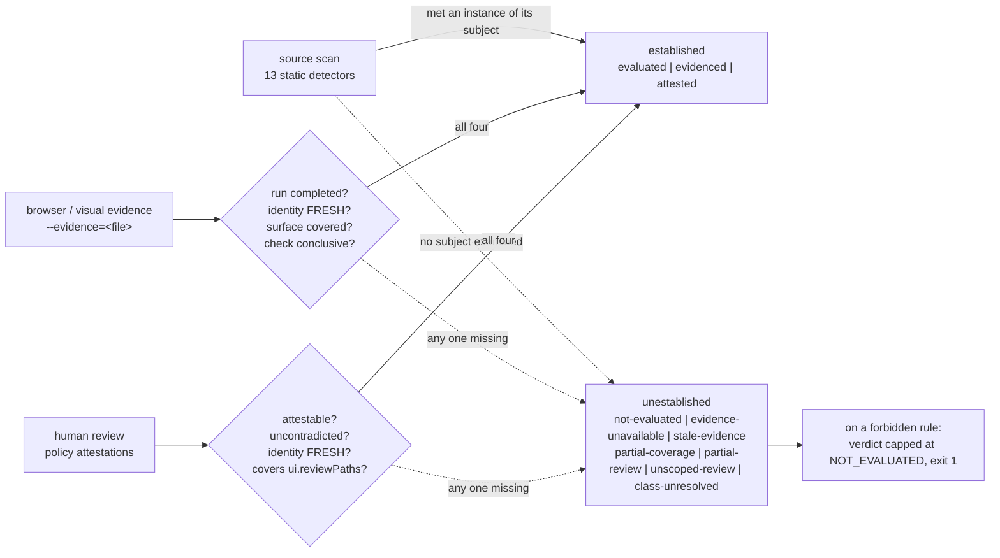

# Architecture

> **Regenerate this document; do not hand-patch it.** Its diagrams are copies of
> [`architecture.mmd`](architecture.mmd), which is canonical, and `npm run diagrams` fails when the two
> disagree. Editing one section of a description leaves the rest quietly wrong, and a confident wrong
> diagram is worse than no diagram — nobody re-reads one they have already understood.

This describes what the repository does today. Where something is planned and not built, it says so
and names the plan section that owns it.

## The shape of a run

Three gates, in order, and the order is the architecture rather than an implementation detail. Each
gate can only be reached by the previous one succeeding, so no result exists on the far side of a
question that was never answered.



**Gate 0 — the configuration.** `scripts/policy.mjs` validates `project-policy.yml` in two layers: a
JSON Schema for representable shape, and cross-field semantic invariants the vendored schema
evaluator's closed keyword set cannot express (ADR 0012). Either failing is **exit 2** and produces no
verdict. A malformed configuration is not a failing project, and reporting one as the other teaches a
CI system that a broken file and a broken product are the same event.

An **absent** policy is a different state from a broken one: the run proceeds, everything reports
`not-evaluated`, and the verdict is `NOT_EVALUATED` at exit 1. Nothing was configured, so nothing was
declared, so nothing is compliant.

**Gate 1 — applicability.** `scripts/applicability.mjs` asks whether this repository has a user
interface at all, from evidence rather than from the declaration. Ten signal families; each detection
carries the paths it was established from and an `OBSERVED` or `INFERRED` label. The three outcomes are
not symmetrical:

- `APPLICABLE` needs one positive signal. Presence can be witnessed.
- `NOT_APPLICABLE` needs **all three** of a declared `no-ui`, a complete scan, and zero contradicting
  signals. It is the state that exempts an entire rule surface, so it is deliberately the hardest to
  reach.
- `INDETERMINATE` is everything else, including zero signals with no declaration. A complete scan
  proves "none of our supported signals were present", never "this repository has no UI".

**Gate 2 — rule evaluation.** `scripts/compliance.mjs` evaluates the catalog against findings,
ingested evidence, and attestations. It is called **twice** over disjoint rule sets — once for the UI
rules and once for the process rules — so the envelope's block boundary is a boundary rather than a
convention, and the two sets cannot share applicability semantics by accident.

## What each evidence surface must pass

Four surfaces, and none of them establishes a rule by existing. Each has its own gate, and every
failure mode below lands on a distinct disposition rather than on a shared "unknown".



The dispositions are the framework's vocabulary for *why* something was not established, and they are
never collapsed into each other. `docs/integration-contract.md` §3.4 is the full table; the
distinctions that cost the most to get right:

| These two look the same and are not | |
| --- | --- |
| `not-evaluated` | nobody tried — no detector, no evidence supplied, no review |
| `evidence-unavailable` | somebody tried and established nothing — the run failed, or an identity could not be reconstructed |
| `stale-evidence` | the material provably changed since the record was made |
| `partial-coverage` | every conclusive check passed, over a surface that was not fully exercised |
| `partial-review` | a human reviewed part of the subject the project declared |
| `class-unresolved` | an interface exists; which class of interface was never established |

On a **forbidden** rule, every one of those caps the verdict at `NOT_EVALUATED` and exits 1. A
prohibition nobody established is not a prohibition anybody kept.

## Freshness

`scripts/content-identity.mjs` is the single owner of every freshness claim — browser evidence and
human review both call it, and a second implementation anywhere in `scripts/` is a test failure.

Identity is SHA-256 over the git object ids of the declared paths **in the committed tree at a named
revision**. Never bytes on disk: two clean checkouts of one commit can hold different bytes once a
line-ending filter is involved, and an identity that varies with checkout configuration is not an
identity. Never the staging area either, which reflects neither the commit nor the working tree
(ADR 0011).

Three outcomes, never collapsed. `FRESH`, `STALE` (change was **proved**), and `EVIDENCE_UNAVAILABLE`
(the subject could not be reconstructed). Where both could apply, provable change wins. Neither
non-fresh outcome is a failure and neither is a pass — both unestablish.

Freshness is path-scoped: work outside the declared subject never stales a record.

## Subjects are declared by the project, not by the evidence producer

A producer that chooses what to measure can widen its claim by measuring less. So both evidence
surfaces are bound to a subject the policy declares, outside the record:

```text
ui.evidencePaths     what a browser run's identity must cover
ui.reviewPaths       what a human review must cover
ui.reviewScopes      a per-rule narrowing of the review subject
```

A browser record whose identity covers different paths is exit 2. A review that does not cover its
subject is `partial-review` and establishes nothing. A policy recording an attestation with no
declared subject is a configuration error at exit 2.

## The commands

| Command | Script | What it establishes |
| --- | --- | --- |
| `uiux-standards audit [path]` | `scripts/uiux.mjs` | Evidence discovery. No policy, no status, no score, no verdict. |
| `uiux-standards validate [path]` | `scripts/uiux.mjs` | The full gate: Gate 0, Gate 1, Gate 2, and the exit code. |
| `uiux-standards applicability [path]` | `scripts/applicability.mjs` | Gate 1 alone. `--self` asserts this repository's own answer. |
| `uiux-standards init [path]` | `scripts/init.mjs` | Scaffolding. `plan()` is pure; `apply()` is the only writer. |
| `npm run policy` | `scripts/policy.mjs` | That a policy is well-formed and coherent — never that a project satisfies it. |
| `npm run inventory` | `scripts/inventory.mjs` | That the standards corpus matches its recorded source inventory. |
| `npm run provenance` | `scripts/provenance.mjs` | That every external claim in prose has a citation that resolves. |
| `npm run rule-identity` | `scripts/rule-identity.mjs` | That prose, the freeze, the catalog, and provenance name one set of identities. |
| `npm run diagrams` | `scripts/diagrams.mjs` | That this document's diagrams match their canonical source. |

## Identity, and the direction it flows

```text
standards/*.md  ## Implementation tables    the corpus NAMES an identity
artifacts/design/rule-catalog-v1.md         the freeze FIXES it
rules/*.json                                the catalog IMPLEMENTS it
scripts/uiux.mjs  DETECTORS                 an evaluator BINDS to it
```

One-way, and `npm run rule-identity` makes that mechanical. A rule that exists because a detector was
convenient to write inverts the catalog's authority, so an unowned catalog rule fails unless the
freeze declares it framework-origin. The freeze is the artifact no generator writes, which is why
provenance is reconciled against it rather than only against the catalog.

## What is not built

- **A browser-evidence producer.** This repository defines and verifies the ingestion contract and
  produces no browser evidence (ADR 0002). Until a producer exists, every `browser-analysis` rule
  reports `not-evaluated` — which is the point rather than a gap concealed. See
  `artifacts/project-plan-breakdown/15-browser-evidence-producer.md`.
- **A reusable CI workflow for consumers**, and the version-identity hardening around it. See
  `artifacts/project-plan-breakdown/13-version-identity-and-reusable-workflow.md`.
- **A real-project dogfood.** No external UI project has exercised these detectors. See
  `artifacts/project-plan-breakdown/14-real-project-dogfood.md`.
- **Portfolio integration** with StandardsOrchestrator and StandardsEnforcer. This repository's
  deliverable is `docs/integration-contract.md`; the adapters live in those repositories. See
  `artifacts/project-plan-breakdown/16-portfolio-integration.md`.

## Zero dependencies

No `dependencies`, no `devDependencies`, no lockfile, no `node_modules`, and no install step in CI.
Node ≥ 18 and `node:test` only. Four files are vendored from EngineeringStandards and record their
provenance in their headers (ADR 0001). If a dependency ever appears, that decision changed and needs
an ADR.
